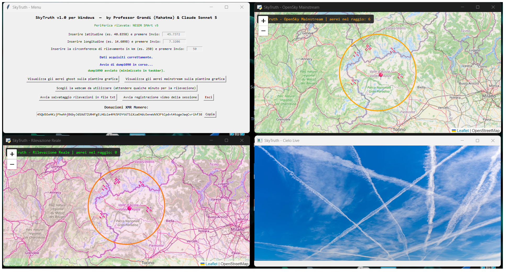

<div align="center">

# ✈️ SkyTruth

### Mainstream Fly vs Ghost Fly

**Confronta in tempo reale ciò che il tuo dongle RTL-SDR rileva davvero nel cielo con i dati pubblici "mainstream" di OpenSky Network.**


</div>



---

## Indice

- [Cos'è SkyTruth](#cosè-skytruth)
- [Funzionalità](#funzionalità)
- [Requisiti](#requisiti)
- [Installazione](#installazione)
  - [Modalità Online](#modalità-online-consigliata)
  - [Modalità Offline (chiavetta USB)](#modalità-offline-chiavetta-usb-senza-internet)
  - [Cosa fa l'installer, passo per passo](#cosa-fa-linstaller-passo-per-passo)
- [Struttura delle cartelle](#struttura-delle-cartelle)
- [Come si usa](#come-si-usa)
- [Componenti software utilizzati](#componenti-software-utilizzati)
- [Risoluzione problemi](#risoluzione-problemi)
- [Architettura tecnica](#architettura-tecnica-per-sviluppatori)
- [Licenza](#licenza)
- [Crediti](#crediti)
- [Donazioni](#donazioni)

---

## Cos'è SkyTruth

**SkyTruth** è un programma per Windows che mette a confronto due "versioni" del traffico aereo sopra la tua testa:

| 👻 Ghost | 🌍 Mainstream |
|---|---|
| Aerei rilevati **dal vivo, via radio**, dal tuo dongle RTL-SDR | Aerei riportati dalla rete pubblica **OpenSky Network** |
| Dati reali, ricevuti direttamente dal segnale a 1090 MHz | Dati condivisi da migliaia di altri ricevitori nel mondo |

L'idea è semplice: se un aereo compare tra i dati "mainstream" ma il tuo dongle non lo rileva mai (o viceversa), può voler dire diverse cose — dalla semplice copertura dell'antenna, fino a casi più interessanti di velivoli che trasmettono meno pubblicamente di altri.

Il programma mostra entrambe le mappe **affiancate in tempo reale**, insieme a una vista live della webcam rivolta al cielo, e permette di registrare l'intera sessione (video e/o dati testuali) per analisi successive.

---

## Funzionalità

- 🗺️ **Due mappe grafiche affiancate** (Leaflet + OpenStreetMap): dati reali dal dongle (verde) e dati OpenSky (arancione)
- 📡 **Rilevamento automatico del dongle RTL-SDR** e avvio di `dump1090` in background
- 📷 **Visualizzazione webcam live** del cielo (solo streaming, nessuna registrazione automatica)
- 🎥 **Registrazione video** dell'intera sessione (schermo completo), con FFmpeg, metadati rimossi automaticamente
- 📝 **Salvataggio testuale delle rilevazioni** (icao, nominativo, altitudine, velocità, rotta, posizione, distanza) in file `.txt`, solo per avvistamenti con dati completi
- 🧹 **Pulizia automatica** di ogni file temporaneo, sia durante l'uso che all'uscita dal programma
- 🛡️ **Gestione robusta degli errori**: il programma non si blocca mai senza spiegazioni — ogni problema mostra un messaggio chiaro
- 💻 **Installer completo e automatico**, sia **online** che **offline** (chiavetta USB, nessuna connessione richiesta)
- 🆓 **100% software gratuito e open source** in ogni componente utilizzato — nessun software craccato o piratato

---

## Requisiti

- **Windows 10 o Windows 11** (64 bit)
- Un **dongle RTL-SDR** compatibile con `dump1090` (testato con Nooelec NESDR SMArt v5)
- Un'**antenna accordata per 1090 MHz** — se usi l'antenna telescopica inclusa in molti kit RTL-SDR, va **accorciata a circa 6,9 cm** per una ricezione ottimale degli aerei
- **Connessione internet** per l'installazione online (oppure i file preparati in anticipo per l'installazione offline)
- **Permessi di amministratore** per l'installazione
- Una **webcam** (opzionale, solo se vuoi usare la vista del cielo)

---

## Installazione

Scarica l'intera cartella **`SkyTruth_Installer`** da questo repository (Code → Download ZIP), estraila, ed apri quella cartella.

### Modalità Online (consigliata)

1. Doppio click su **`install.bat`**
2. Accetta la richiesta di permessi di amministratore
3. Segui i passaggi a video (ogni fase è numerata e spiegata chiaramente)
4. Al termine, troverai un'icona **SkyTruth** sul Desktop

L'installazione scarica automaticamente tutto il necessario (circa 150-250 MB in totale, a seconda dei componenti già presenti).

### Modalità Offline (chiavetta USB, senza internet)

> 📥 **Scarica il pacchetto già pronto**: [`SkyTruth-Offline-Bundle.zip`](https://github.com/professorgrandi/SkyTruth-Windows/releases/latest) (allegato alla Release più recente) contiene già tutti i file elencati qui sotto, pronti da estrarre — non serve scaricarli uno per uno manualmente.

Se vuoi installare SkyTruth su un PC senza connessione internet, prepara in anticipo (su un PC con internet) questi file, nelle sottocartelle indicate dentro `SkyTruth_Installer\offline\`:

| Cartella | File da scaricare | Fonte ufficiale |
|---|---|---|
| `offline\python\` | `python-3.12.7-embed-amd64.zip` | [python.org](https://www.python.org/ftp/python/3.12.7/python-3.12.7-embed-amd64.zip) |
| `offline\python\` | `get-pip.py` | [bootstrap.pypa.io](https://bootstrap.pypa.io/get-pip.py) |
| `offline\python\` | `python-3.12.7-amd64.exe` *(installer completo, serve solo per abilitare Tkinter)* | [python.org](https://www.python.org/ftp/python/3.12.7/python-3.12.7-amd64.exe) |
| `offline\dump1090\` | `main.zip` *(rinominato così dopo il download)* | [GitHub - timseed/Dump1090\_Windows](https://github.com/timseed/Dump1090_Windows/archive/refs/heads/main.zip) |
| `offline\ffmpeg\` | un qualsiasi file `ffmpeg-*.zip` *(build "essentials")* | [gyan.dev](https://www.gyan.dev/ffmpeg/builds/ffmpeg-release-essentials.zip) |
| `offline\webview2\` | `MicrosoftEdgeWebview2Setup.exe` | [Microsoft Edge WebView2](https://developer.microsoft.com/microsoft-edge/webview2/) (pulsante "Get the link", bootstrapper Evergreen) |

Poi lancia `install.bat` normalmente: l'installer **cerca prima nella cartella `offline\`**, e scarica da internet solo ciò che non trova già pronto lì.

> 💡 Puoi anche mescolare le due modalità: se metti solo *alcuni* dei file sopra, l'installer userà quelli offline disponibili e scaricherà solo i rimanenti.

*(In alternativa a preparare i file uno per uno, ricordati che il pacchetto `SkyTruth-Offline-Bundle.zip` linkato sopra li contiene già tutti pronti — basta estrarlo dentro `offline\`.)*

### Cosa fa l'installer, passo per passo

<details>
<summary>Clicca per vedere l'elenco completo dei 13 passaggi</summary>

1. Verifica dei privilegi di amministratore (si riavvia da solo elevato, se serve)
2. Creazione della struttura di cartelle in `C:\SkyTruth\`
3. Download/installazione di Python 3.12.7 (embedded)
4. Aggiunta del supporto **Tkinter** (necessario per l'interfaccia grafica — non incluso di default nel pacchetto embedded di Python)
5. Abilitazione di `pip` e installazione delle librerie Python richieste (`pywebview`, `opencv-python`, `pygrabber`)
6. Download/installazione di `dump1090`
7. Download/installazione di `FFmpeg`
8. Verifica/installazione del componente **WebView2 Runtime** (necessario per le mappe; già incluso di serie su Windows 11)
9. Copia di `main.py` e dell'icona nella cartella principale
10. Creazione del collegamento sul Desktop
11. Verifica finale di PowerShell
12. Pulizia di tutti i file temporanei di installazione (nessun residuo lasciato sul sistema)
13. Riepilogo finale, con log completo salvato in `C:\SkyTruth\logs\`

Ogni passaggio è mostrato chiaramente a video **e** registrato nel file di log — se qualcosa va storto, il log contiene tutti i dettagli necessari per capire cosa è successo, senza dover ripetere l'intera installazione.

</details>

---

## Struttura delle cartelle

Dopo l'installazione, tutto vive sotto `C:\SkyTruth\`:

```
C:\SkyTruth\
│
├── main.py                  ← programma principale
├── skytruth.ico              ← icona del programma
│
├── python\                  ← Python 3.12.7 (embedded, con supporto Tkinter aggiunto)
├── dump1090\                ← decoder ADS-B per il dongle RTL-SDR
├── ffmpeg\                  ← usato per la registrazione video
├── maps\                    ← pagine delle mappe (generate automaticamente)
│
├── temp\                    ← file temporanei di sessione (svuotata automaticamente)
├── sessioni_video\          ← qui vengono salvate le registrazioni video
├── sessioni_txt\            ← qui vengono salvati i file di rilevazione testuale
└── logs\                    ← log giornalieri del programma
```

---

## Come si usa

1. Avvia SkyTruth dall'icona sul Desktop
2. Il programma rileva automaticamente il dongle RTL-SDR collegato
3. Inserisci **latitudine**, **longitudine** e **raggio di rilevazione** (in km) del punto di osservazione, premendo Invio dopo ognuno
4. `dump1090` si avvia automaticamente (minimizzato nella barra delle applicazioni — puoi riaprirlo in qualsiasi momento per controllare i dati grezzi in arrivo)
5. Usa i bottoni per aprire:
   - la **piantina grafica "ghost"** (dati reali dal dongle)
   - la **piantina grafica "mainstream"** (dati OpenSky)
   - la **webcam** (scegli quale usare da un elenco con i nomi corretti)
6. Facoltativo: avvia la **registrazione video** della sessione, e/o il **salvataggio delle rilevazioni** in un file di testo
7. Premi **Esci** (o chiudi la finestra) per terminare in modo pulito: eventuali registrazioni attive vengono salvate automaticamente, tutti i processi collegati vengono chiusi, e i file temporanei vengono ripuliti

---

## Componenti software utilizzati

Tutti i componenti sono **gratuiti e open source** (o gratuiti a livello ufficiale, nel caso di WebView2), scaricati dalle fonti ufficiali durante l'installazione — nessuno di essi è distribuito insieme a questo repository.

| Componente | Uso | Licenza |
|---|---|---|
| [Python](https://www.python.org/) | Linguaggio del programma | PSF License |
| [dump1090](https://github.com/timseed/Dump1090_Windows) (fork Windows di [antirez/dump1090](https://github.com/antirez/dump1090)) | Decodifica dei segnali ADS-B dal dongle RTL-SDR | BSD 3-Clause |
| [FFmpeg](https://ffmpeg.org/) | Registrazione video della sessione | GPL/LGPL (a seconda della build) |
| [pywebview](https://pywebview.flowrl.com/) | Finestre native per le mappe (basato su WebView2) | BSD |
| [OpenCV](https://opencv.org/) (`opencv-python`) | Accesso e visualizzazione della webcam | Apache 2.0 |
| [pygrabber](https://github.com/bunkahle/pygrabber) | Rilevamento corretto dei nomi delle webcam | MIT |
| [Microsoft Edge WebView2 Runtime](https://developer.microsoft.com/microsoft-edge/webview2/) | Motore di rendering per le mappe | Distribuzione gratuita Microsoft |
| [Leaflet.js](https://leafletjs.com/) + [OpenStreetMap](https://www.openstreetmap.org/) | Visualizzazione cartografica | BSD-2-Clause / ODbL |
| [OpenSky Network API](https://opensky-network.org/) | Dati pubblici "mainstream" sul traffico aereo | Gratuita, uso pubblico |

---

## Risoluzione problemi

<details>
<summary><b>"Nessuna periferica dongle rilevata"</b></summary>

Verifica che il dongle RTL-SDR sia collegato correttamente e riconosciuto da Windows (Gestione dispositivi). Se necessario, installa i driver e riavvia il programma.
</details>

<details>
<summary><b>Il dongle è rilevato ma non vedo nessun aereo</b></summary>

Quasi sempre è un problema di **antenna**: verifica che sia quella giusta (accordata per 1090 MHz, non quella per 433 MHz o UHF generico) e che sia posizionata con buona visuale del cielo, il più in alto possibile. Un'antenna telescopica generica va accorciata a circa **6,9 cm** per una ricezione ottimale a 1090 MHz.
</details>

<details>
<summary><b>"Nessuna webcam rilevata"</b></summary>

Verifica che la webcam sia collegata e riconosciuta da Windows, installa eventuali driver mancanti e riavvia il programma.
</details>

<details>
<summary><b>L'installer segnala errori su singoli componenti</b></summary>

Controlla il file di log dettagliato in `C:\SkyTruth\logs\install_log_*.txt`. Molti passaggi (download) vengono ritentati automaticamente; se un componente specifico continua a fallire, puoi anche procurartelo manualmente e metterlo nella cartella `offline\` corrispondente, poi rilanciare l'installer.
</details>

---

## Architettura tecnica (per sviluppatori)

<details>
<summary>Clicca per i dettagli tecnici</summary>

- **Interfaccia menu**: Tkinter
- **Mappe**: due piccoli web server locali (libreria standard Python, nessuna dipendenza esterna) che servono pagine HTML con Leaflet.js, visualizzate in finestre native tramite `pywebview`
- **Layout**: l'area di lavoro dello schermo (esclusa la barra applicazioni) è divisa in 4 quadranti calcolati dal centro verso i lati
- **Posizionamento finestre**: tecnica "a fotografia" (snapshot delle finestre visibili prima/dopo l'avvio di un processo), più affidabile della ricerca per titolo o per PID — necessaria perché su Windows le finestre console appartengono realmente a `conhost.exe`, non al processo che le ha aperte
- **Dati dal dongle**: lettura diretta del flusso SBS (BaseStation) di `dump1090` sulla porta 30003, elaborato in tempo reale
- **Dati OpenSky**: interrogazione periodica dell'API pubblica REST, con bounding box calcolato da posizione e raggio inseriti dall'utente
- **Registrazione video**: `FFmpeg` con cattura schermo (`gdigrab`), fermata in modo pulito (comando `q` su stdin) per non corrompere il file, poi ripulita dai metadati
- **Python embedded + Tkinter**: il pacchetto "embeddable" ufficiale di Python non include Tkinter; l'installer lo aggiunge prelevando i file necessari da un'installazione Python completa temporanea (installata, usata, poi disinstallata automaticamente)

</details>

---

## Licenza

Questo progetto è distribuito con **licenza MIT** — vedi il file [LICENSE](LICENSE) per il testo completo.

I componenti scaricati dall'installer (dump1090, FFmpeg, ecc.) mantengono le proprie licenze originali, elencate nella tabella dei componenti sopra.

---

## Crediti

Sviluppato da **Professor Grandi (Mahatma)** & **Claude Sonnet 5** (Anthropic).

---

## Donazioni

Se questo progetto ti è stato utile, puoi supportarne lo sviluppo con una donazione volontaria in Monero (XMR):

```
45QW5EeHKzjFhwhhjB6byJdSXd7ZUR4FgELHGz1e4Mt5M3Yt6TSiXzaEHdcEeneWVX3FtCpdvt4toge3aqCvrihf38SSVGv
```

---

<div align="center">

*SkyTruth è un progetto amatoriale, sviluppato per hobby e curiosità personale. Non è affiliato a OpenSky Network, dump1090, FFmpeg o Microsoft.*

</div>
